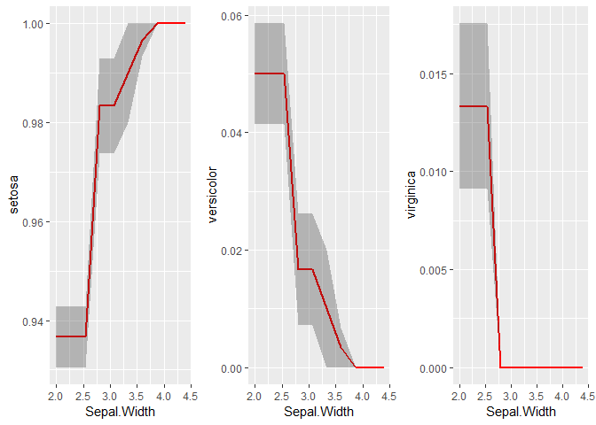
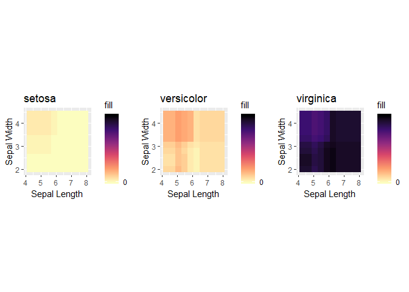

<!-- README.md is generated from README.Rmd. Please edit that file -->
explainer
=========

[](https://travis-ci.org/thiyangt/explainer)

Installation
------------

``` r
# install.packages("devtools")
devtools::install_github("thiyangt/explainer")
library(explainer)
```

Usage
-----

### Number of times each variable appear in each tree in the forest (`forest_info`).

``` r
library(explainer)
library(randomForest)
library(ggplot2)
set.seed(2018)
forest <- randomForest(Species ~ ., data = iris, ntree=50)
forest_details <- forest_info(forest, 50)
table_count_treeLevel <- lapply(forest_details,function(temp){as.data.frame(table(temp))})
table_count_treeLevel[1:2] ## show results corresponds to first two trees
#> [[1]]
#>           temp Freq
#> 1 Petal.Length    2
#> 2  Petal.Width    4
#> 3 Sepal.Length    2
#> 4  Sepal.Width    1
#> 
#> [[2]]
#>           temp Freq
#> 1 Petal.Length    3
#> 2  Petal.Width    2
#> 3 Sepal.Length    1
```

### Total number of times each variable appear in the forest

``` r
library(data.table)
full_forestLevel <- rbindlist(table_count_treeLevel, use.names=TRUE)
fullforest <- split(full_forestLevel, full_forestLevel$temp)
variable_freq <- sapply(fullforest , function(temp){sum(temp$Freq)})
variable_freq 
#> Petal.Length  Petal.Width Sepal.Length  Sepal.Width 
#>          137          136           87           61
variable_percent <- variable_freq/sum(variable_freq)*100
variable_percent
#> Petal.Length  Petal.Width Sepal.Length  Sepal.Width 
#>     32.54157     32.30404     20.66508     14.48931
```

ICE curves using a subset of data `ice`
---------------------------------------

``` r
subset_iris <- iris[10:15, -5]
ice_SW <- ice_cal(forest, Sepal.Width, iris, subset_iris, grid.resolution=10, trim.outliers=FALSE)

ice_SW$variable <- rep(1:6,10)
f1 <-  ggplot(data = ice_SW, aes_string(x = ice_SW$Sepal.Width, y = ice_SW$setosa)) +
  stat_summary(fun.y = mean, geom = "line", col = "red", size = 1) + xlab("Sepal.Width") +
  stat_summary(fun.data = mean_cl_normal, geom = "ribbon", fun.args = list(mult = 1), alpha = 0.3) +
  theme(legend.position = "none") + ylab("setosa")

f2 <- ggplot(data = ice_SW, aes_string(x = ice_SW$Sepal.Width, y = ice_SW$versicolor)) +
  stat_summary(fun.y = mean, geom = "line", col = "red", size = 1) + xlab("Sepal.Width") +
  stat_summary(fun.data = mean_cl_normal, geom = "ribbon", fun.args = list(mult = 1), alpha = 0.3) +
  theme(legend.position = "none") + ylab("versicolor")

f3 <- ggplot(data = ice_SW, aes_string(x = ice_SW$Sepal.Width, y = ice_SW$virginica)) +
  stat_summary(fun.y = mean, geom = "line", col = "red", size = 1) + xlab("Sepal.Width") +
  stat_summary(fun.data = mean_cl_normal, geom = "ribbon", fun.args = list(mult = 1), alpha = 0.3) +
  theme(legend.position = "none") + ylab("virginica")

gridExtra::grid.arrange(f1, f2, f3, ncol=3)
```



Two-way partial dependency plots
--------------------------------

Create two-way partial dependency plots based on **subset of training data** used to train the random forest: `twowayinteraction`.

``` r

SL_PW_interaction <- twowayinteraction(forest, Sepal.Length, Petal.Width, iris, iris, grid.resolution=10)
head(SL_PW_interaction)
#> # A tibble: 6 x 9
#>   Sepal.Length Petal.Width Sepal.Width Petal.Length Species    id setosa
#>          <dbl>       <dbl>       <dbl>        <dbl> <fct>   <int>  <dbl>
#> 1          4.3         0.1         3.5          1.4 setosa      1      1
#> 2          4.3         0.1         3            1.4 setosa      2      1
#> 3          4.3         0.1         3.2          1.3 setosa      3      1
#> 4          4.3         0.1         3.1          1.5 setosa      4      1
#> 5          4.3         0.1         3.6          1.4 setosa      5      1
#> 6          4.3         0.1         3.9          1.7 setosa      6      1
#> # ... with 2 more variables: versicolor <dbl>, virginica <dbl>
```

Graphical representation of **SL\_PW\_interaction**

``` r

p1 <-  ggplot(
  data = SL_PW_interaction, aes_string(x = SL_PW_interaction$Sepal.Length,y = SL_PW_interaction$Petal.Width, z = SL_PW_interaction$setosa, fill = SL_PW_interaction$setosa
  ))+geom_tile() + 
  scale_fill_viridis_c(limits = c(0, 1), breaks = seq(0, 1, 100),option = "A", direction = -1)+
  xlab("Sepal Length") + ylab("Petal Width") + theme(legend.position="none", aspect.ratio=1)+ggtitle("setosa")

p2 <-  ggplot(
  data = SL_PW_interaction, aes_string(x = SL_PW_interaction$Sepal.Length,y = SL_PW_interaction$Petal.Width, z = SL_PW_interaction$versicolor, fill = SL_PW_interaction$versicolor
  ))+geom_tile() + 
  scale_fill_viridis_c(limits = c(0, 1), breaks = seq(0, 1, 100),option = "A", direction = -1)+
  xlab("Sepal Length") + ylab("Petal Width") + theme(legend.position="none", aspect.ratio=1)+ggtitle("versicolor")

p3 <-  ggplot(
  data = SL_PW_interaction, aes_string(x = SL_PW_interaction$Sepal.Length,y = SL_PW_interaction$Petal.Width, z = SL_PW_interaction$virginica, fill = SL_PW_interaction$virginica
  ))+geom_tile() + 
  scale_fill_viridis_c(limits = c(0, 1), breaks = seq(0, 1, 100),option = "A", direction = -1)+
  xlab("Sepal Length") + ylab("Petal Width") + theme(legend.position="none", aspect.ratio=1)+ggtitle("virginica")

gridExtra::grid.arrange(p1, p2, p3, ncol=3)
```


``` r
SL_SW_interaction <- twowayinteraction(forest, Sepal.Length, Sepal.Width, iris, iris, grid.resolution=10)
#> Joining, by = "id"
head(SL_SW_interaction)
#> # A tibble: 6 x 9
#>   Sepal.Length Sepal.Width Petal.Length Petal.Width Species    id setosa
#>          <dbl>       <dbl>        <dbl>       <dbl> <fct>   <int>  <dbl>
#> 1          4.3           2          1.4         0.2 setosa      1   0.96
#> 2          4.3           2          1.4         0.2 setosa      2   0.96
#> 3          4.3           2          1.3         0.2 setosa      3   0.96
#> 4          4.3           2          1.5         0.2 setosa      4   0.96
#> 5          4.3           2          1.4         0.2 setosa      5   0.96
#> 6          4.3           2          1.7         0.4 setosa      6   0.96
#> # ... with 2 more variables: versicolor <dbl>, virginica <dbl>


f1 <-  ggplot(
  data = SL_SW_interaction, aes_string(x = SL_SW_interaction$Sepal.Length,y = SL_SW_interaction$Sepal.Width, z = SL_SW_interaction$setosa, fill = SL_SW_interaction$setosa
  ))+geom_tile() + 
  scale_fill_viridis_c(limits = c(0, 1), breaks = seq(0, 1, 100),option = "A", direction = -1)+
  xlab("Sepal Length") + ylab("Sepal Width") + theme( aspect.ratio=1)+ggtitle("setosa")

f2 <-  ggplot(
  data = SL_SW_interaction, aes_string(x = SL_SW_interaction$Sepal.Length,y = SL_SW_interaction$Sepal.Width, z = SL_SW_interaction$versicolor, fill = SL_SW_interaction$versicolor
  ))+geom_tile() + 
  scale_fill_viridis_c(limits = c(0, 1), breaks = seq(0, 1, 100),option = "A", direction = -1)+
  xlab("Sepal Length") + ylab("Sepal Width") + theme( aspect.ratio=1)+ggtitle("versicolor")

f3 <-  ggplot(
  data = SL_SW_interaction, aes_string(x = SL_SW_interaction$Sepal.Length,y = SL_SW_interaction$Sepal.Width, z = SL_SW_interaction$virginica, fill = SL_SW_interaction$virginica
  ))+geom_tile() + 
  scale_fill_viridis_c(limits = c(0, 1), breaks = seq(0, 1, 100),option = "A", direction = -1)+
  xlab("Sepal Length") + ylab("Sepal Width") + theme( aspect.ratio=1)+ggtitle("virginica")

gridExtra::grid.arrange(f1, f2, f3, ncol=3)
```


